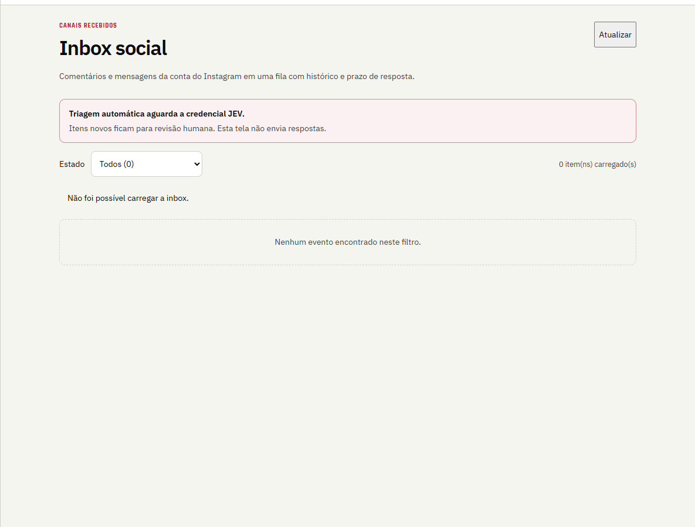

# QA da Inbox social, 28/09/2026

O smoke autenticado foi executado no Microsoft Edge headless contra uma imagem descartável compilada da árvore de trabalho. As credenciais foram lidas do ambiente dos serviços em memória; nenhum valor foi registrado.

- `GET /prospector/inbox`: HTTP 200; título `Inbox social`; nenhum erro JavaScript.
- Sessão autenticada: HTTP 200; `/prospector/api/theses`: HTTP 200.
- `GET /prospector/api/inbox`: HTTP 500. O log sanitizado registra que a relação `editorial.social_inbox_events` não existe no banco conectado. A migration `0050_meta_inbox_events` ainda não foi aplicada ao banco persistente.
- A imagem ativa derivada do commit `0a90325` não contém a página no manifesto. A compilação isolada da árvore atual inclui `/inbox`; ela não substituiu o serviço em execução.
- A captura registra o estado de erro da consulta, não confirma quantidade real de eventos. A mensagem de revisão humana indica que o JEV ainda não foi cadastrado.

Não houve migration persistente, deploy, resposta de mensagem ou ativação de agenda.
